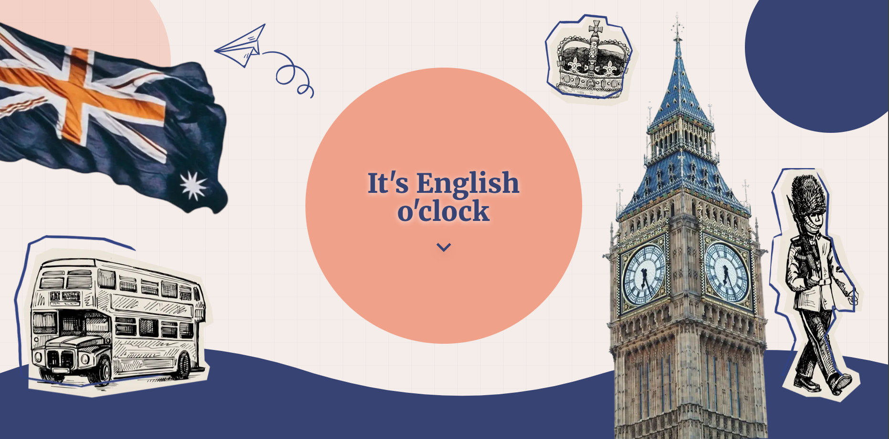
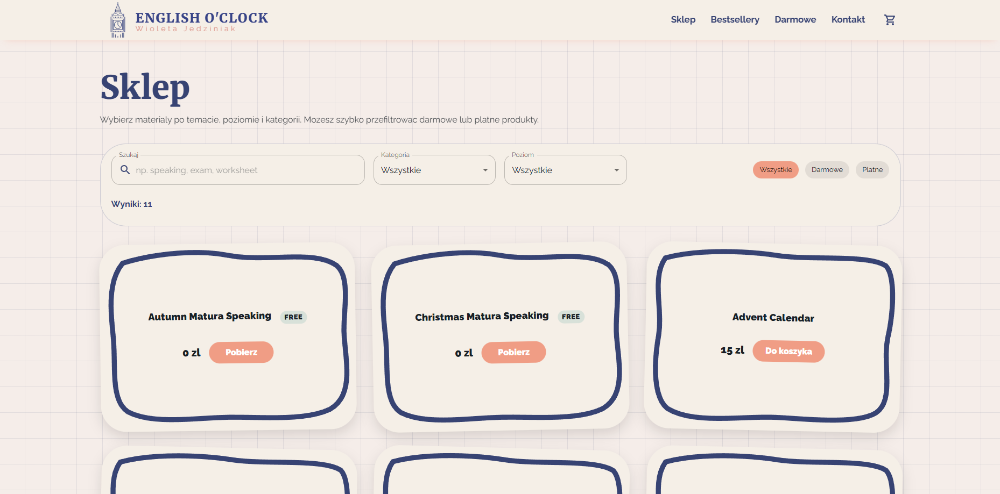
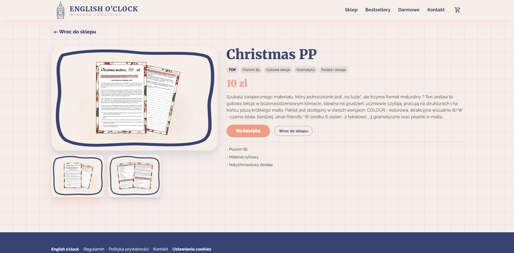

# It's English O'Clock

A commercial English-learning website and digital product store built with `Next.js`, `React`, and `MUI`.

## What's included

- landing page with product and brand presentation
- digital product store with browsing and filtering
- product detail views and purchase flow
- free resource delivery
- contact and customer communication flows
- privacy, cookie consent, and legal pages

## Stack

- `Next.js` App Router
- `React`
- `TypeScript`
- `MUI` + `emotion`

## Screenshots

### Homepage

### Store

### Product page

## Legal notice

This repository is public, but the project itself is proprietary.

All source code, branding, visual assets, and educational content in this repository are protected and may not be copied, modified, redistributed, sublicensed, or used commercially without prior written permission.

All rights reserved.

See [LICENSE.md](LICENSE.md) for the full notice.
